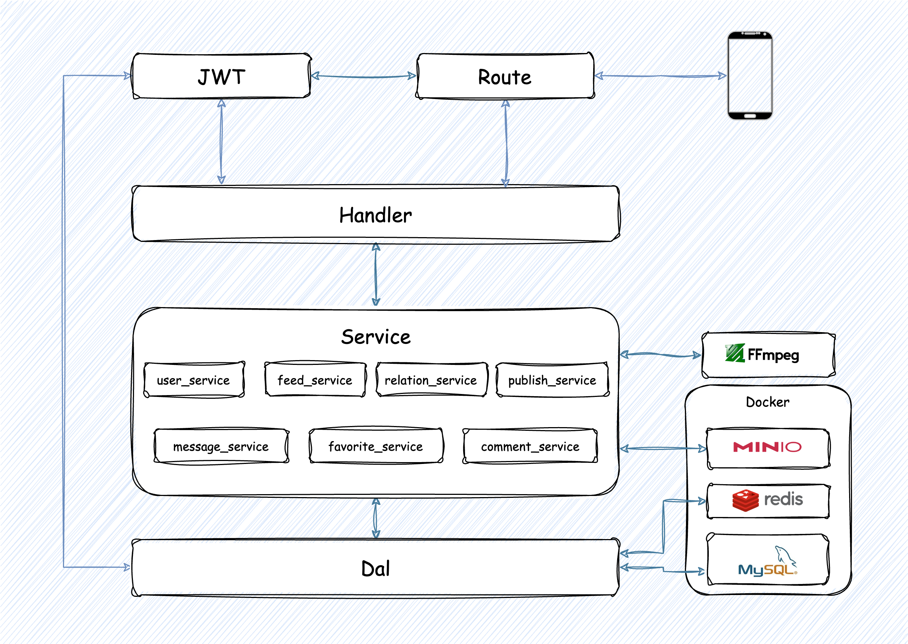

# tiktok_demo
 A simple hertz server that provides user, video, interactive, and social backend services for tiktok app.
## How to run
#### 1. tiktok_demo in the local environment

[Download ffmpeg package](https://ffmpeg.org/download.html) && **add ffmpeg to system path or user path**
```shell
# Install other services
docker-compose up -d

go build -o tiktok_demo && ./tiktok_demo
```

#### 2. tiktok_demo in the docker environment
```shell
# Compile in docker image && Packaged with ffmpeg
docker build -t tiktok:latest -f ./docker-build/Dockerfile .

# Start all service
cd docker-build 
docker-compose up -d
```

## Description
### Technology Architecture



### Catalog Introduce
```shell
.
├── biz              #  Business logic
│   ├── dal          #  Interaction with the database                             
│   ├── handler      #  Handle request and response
│   ├── model        #  Model definition
│   ├── mw           #  Middleware
│   ├── router       
│   └── service      #  Service implementation
├── docker-build     #  dockerfile 
├── idl              #  Interface definition file
├── pkg 
│   ├── configs      #  Component config
│   ├── constants    #  Common constant
│   ├── data         #  Data Persistence Directory
│   ├── errno        
│   └── utils        
├── docker-compose.yml 
├── Makefile         #  Command to generate code by IDL 
├── hz_gen.sh
├── go.mod
├── go.sum
├── README.md
├── main.go
├── router_gen.go
└── router.go
```

### Service Introduce

| Service  | Function                                                   |
|----------|------------------------------------------------------------|
| user     | User register / Get user information                       |
| relation | Follow / Get follow list / Get friend (mutual follow) list |
| publish  | Publish video                                              |
| feed     | Get the last few of all videos as a feed stream            |
| favorite | Like the video                                             |
| comment  | Comment on a video                                         |
| message  | Send message with friends / Get message list with friends  |

maintained by: [leeeezp](https://github.com/leeeezp) [Kpole](https://github.com/Kpole) [zztaki](https://github.com/zztaki) [BourneHUST](https://github.com/BourneHUST) [meyoung512](https://github.com/meyoung512)