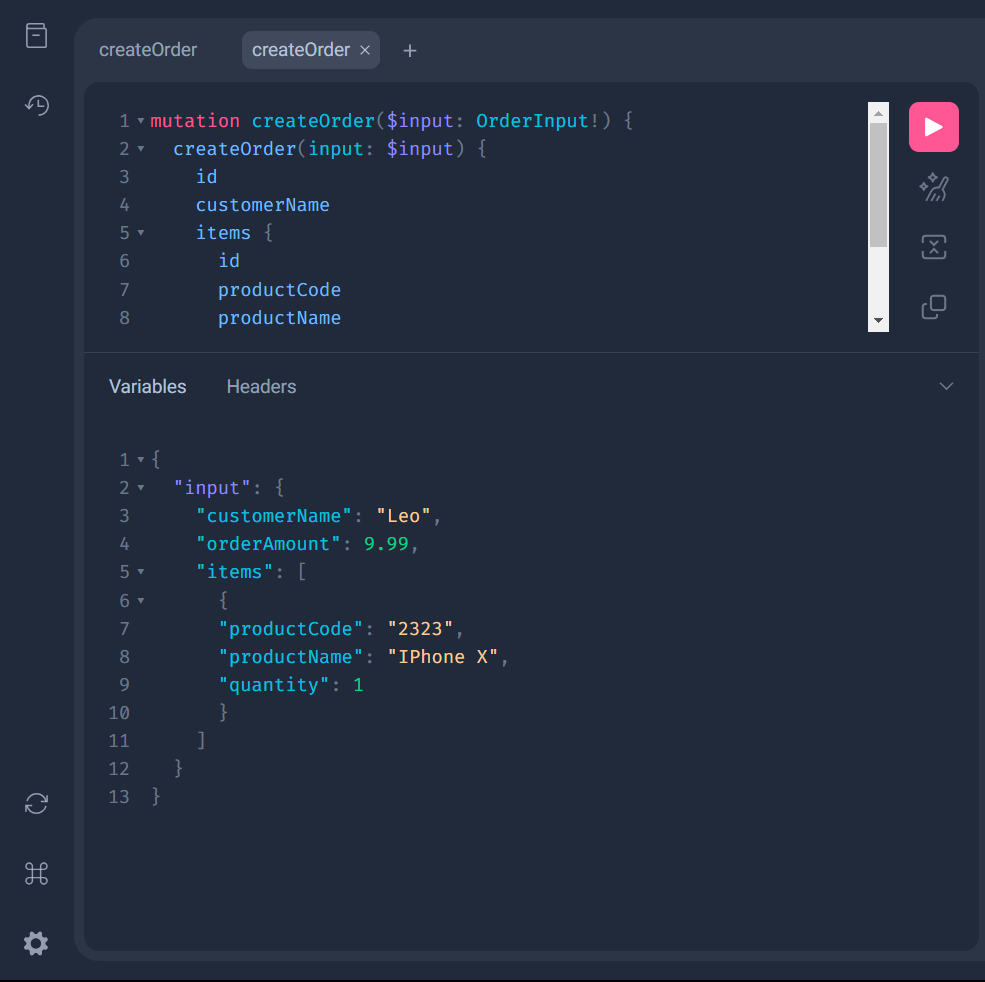

## graph

### Introduction

This is a example of using graphql in hertz server.

### How to run
- Start a mysql image
```bash
docker-compose up -d
```

1. Start the server

```go
go run server.go
```

2. Test the server

Access http://localhost:8080 for testing GraphQL

3. Create order

```graphql
mutation createOrder($input: OrderInput!) {
  createOrder(input: $input) {
    id
    customerName
    items {
      id
      productCode
      productName
      quantity
    }
  }
}
```
```json
{
  "input": {
    "customerName": "Leo",
    "orderAmount": 9.99,
    "items": [
      {
        "productCode": "2323",
        "productName": "IPhone X",
        "quantity": 1
      }
    ]
  }
}
```


4. Query order

```graphql
query orders {
  orders {
    id  
    customerName
    items {
      productName
      quantity
    }
  }
}
```
5. Update order

```graphql
mutation updateOrder ($orderId: Int!, $input: OrderInput!) {
    updateOrder(orderId: $orderId, input: $input) {
        id
        customerName
        items {
            id
            productCode
            productName
            quantity
        }
    }
}
```
```json
{
  "orderId": 1,
  "input": {
    "customerName": "Leo",
    "orderAmount": 9.99,
    "items": [
      {
        "productCode": "2323",
        "productName": "IPhone X",
        "quantity": 1
      }
    ]
  }
}
```

6. Delete order

```graphql
mutation deleteOrder ($orderId: Int!) {
  deleteOrder(orderId: $orderId)
}
```
```json
{
  "orderId": 1
}
```
### How to update code

1. In `graph` folder, you can create files with `.graphql` suffix, and then run `make generate` to generate code by default.
2. If you want custom model in `graph/model.go`, you can run `make generate-custom` to generate code. For Example `graph/generate.go`, my action is used to add a foreign key and a primary key to the model.

```go
//go:build ignore
// +build ignore

package main

import (
	"fmt"
	"os"

	"github.com/99designs/gqlgen/api"
	"github.com/99designs/gqlgen/codegen/config"
	"github.com/99designs/gqlgen/plugin/modelgen"
)

func mutateHook(b *modelgen.ModelBuild) *modelgen.ModelBuild {
	for _, model := range b.Models {
		for _, field := range model.Fields {
			if field.Name == "id" {
				field.Tag += ` gorm:"primaryKey"`
			}
			if field.Name == "items" {
				field.Tag += ` gorm:"foreignKey:ID"`
			}
		}
	}
	return b
}

func main() {
	cfg, err := config.LoadConfigFromDefaultLocations()
	if err != nil {
		fmt.Fprintln(os.Stderr, "failed to load config", err.Error())
		os.Exit(2)
	}

	// Attaching the mutation function onto modelgen plugin
	p := modelgen.Plugin{
		MutateHook: mutateHook,
	}

	err = api.Generate(cfg, api.ReplacePlugin(&p))

	if err != nil {
		fmt.Fprintln(os.Stderr, err.Error())
		os.Exit(3)
	}
}

```
