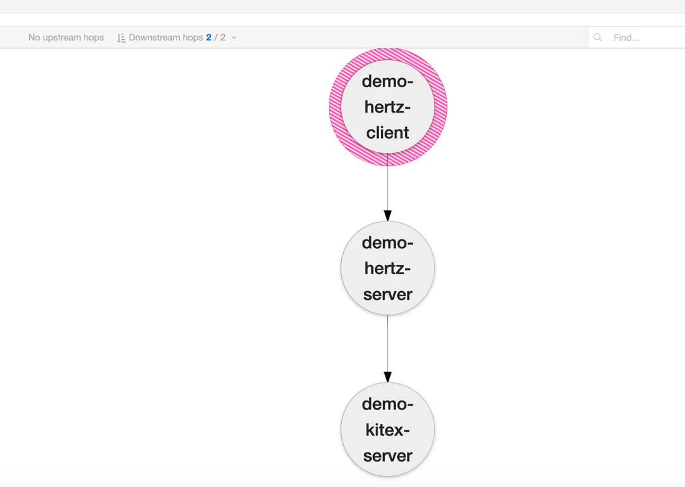
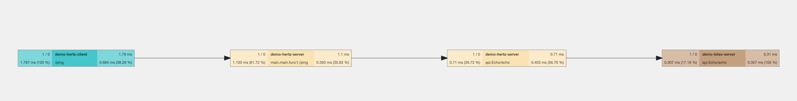
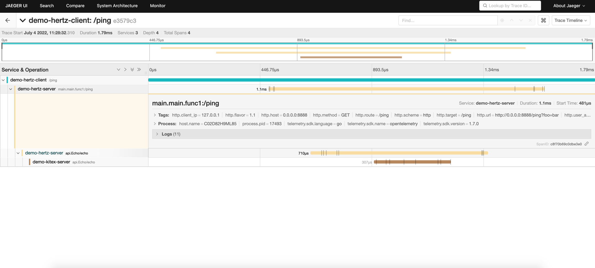
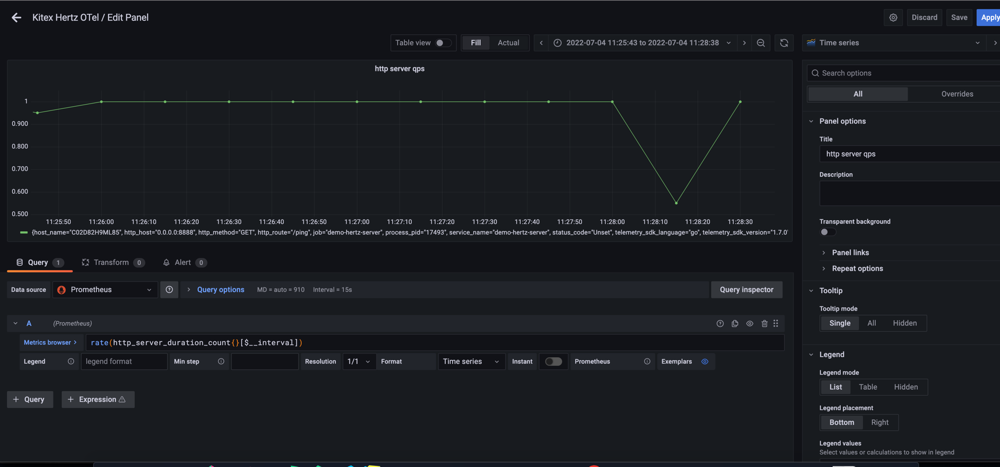

# Opentelemetry Example

## Example service dependencies


## HOW-TO-RUN
1. install docker
2. run opentelemetry-collector、jaeger、victoriametrics、grafana: `docker-compose up -d`
3. run Kitex server: `go run kitex/server/main.go`
4. run Hertz server: `go run hertz/server/main.go`
5. run Hertz client: `go run hertz/client/main.go`

## MONITORING

## View Trace
You can then navigate to http://localhost:16686 to access the Jaeger UI. (You can visit Monitor Jaeger for details)





## View Metrics
You can then navigate to http://localhost:3000 to access the Grafana UI. (You can visit Monitor Grafana for metrics)

### add datasource

URL: `http://victoriametrics:8428/`


### add a dashboard and a panel

### support metrics 
- HTTP Metrics
- Runtime Metrics

## Server usage
```go
import (
    ...
    "github.com/hertz-contrib/obs-opentelemetry/provider"
    "github.com/hertz-contrib/obs-opentelemetry/tracing"
)


func main()  {
    serviceName := "echo"
	
    p := provider.NewOpenTelemetryProvider(
        provider.WithServiceName(serviceName),
        provider.WithExportEndpoint("localhost:4317"),
        provider.WithInsecure(),
    )
    defer p.Shutdown(context.Background())

    tracer, cfg := hertztracing.NewServerTracer()
    h := server.Default(tracer)
    h.Use(hertztracing.ServerMiddleware(cfg))
    
    ...
	
    h.Spin()
}

```

## Client usage
```go
import (
    ...
    "github.com/hertz-contrib/obs-opentelemetry/provider"
    "github.com/hertz-contrib/obs-opentelemetry/tracing"
)

func main(){
    serviceName := "echo-client"
	
    p := provider.NewOpenTelemetryProvider(
        provider.WithServiceName(serviceName),
        provider.WithExportEndpoint("localhost:4317"),
        provider.WithInsecure(),
    )
    defer p.Shutdown(context.Background())

    c, _ := client.NewClient()
    c.Use(hertztracing.ClientMiddleware())

    ...   
	
}

```

## Tracing associated Logs

#### set logger impl
```go
import (
    hertzlogrus "github.com/hertz-contrib/obs-opentelemetry/logging/logrus"
)

func init()  {
    hlog.SetLogger(hertzlogrus.NewLogger())
    hlog.SetLevel(hlog.LevelDebug)

}
```

#### log with context

```go
h.GET("/ping", func(c context.Context, ctx *app.RequestContext) {
    req := &api.Request{Message: "my request"}
    resp, err := client.Echo(c, req)
    if err != nil {
        hlog.Errorf(err.Error())
    }
    hlog.CtxDebugf(c, "message received successfully: %s", req.Message)
    ctx.JSON(consts.StatusOK, resp)
})
```

#### view log

```log
{"level":"debug","msg":"message received successfully: my request","span_id":"445ef16484a171b8","time":"2022-07-04T06:27:35+08:00","trace_flags":"01","trace_id":"e9e579b32c9d6b0598f8f33d65689e06"}
```


# Work with Jaeger
> [Introducing native support for OpenTelemetry in Jaeger](https://medium.com/jaegertracing/introducing-native-support-for-opentelemetry-in-jaeger-eb661be8183c)

Jaeger natively supports OTLP protocol, and we can send data directly to Jaeger without OpenTelemetry Collector

### Jaeger Architecture 
> Image from [jaeger](https://github.com/jaegertracing/jaeger)


### Demo

#### Run Jaeger with COLLECTOR_OTLP_ENABLED
```yaml
version: "3.7"
services:
  # Jaeger
  jaeger-all-in-one:
    image: jaegertracing/all-in-one:latest
    environment:
      - COLLECTOR_OTLP_ENABLED=true
    ports:
      - "4317:4317"   # OTLP gRPC receiver
```

#### Config Exporter with Environment
```yaml
export OTEL_EXPORTER_OTLP_ENDPOINT=http://localhost:4317
export OTEL_EXPORTER_OTLP_PROTOCOL=grpc
```

### Run Exeample App and View Jaeger


